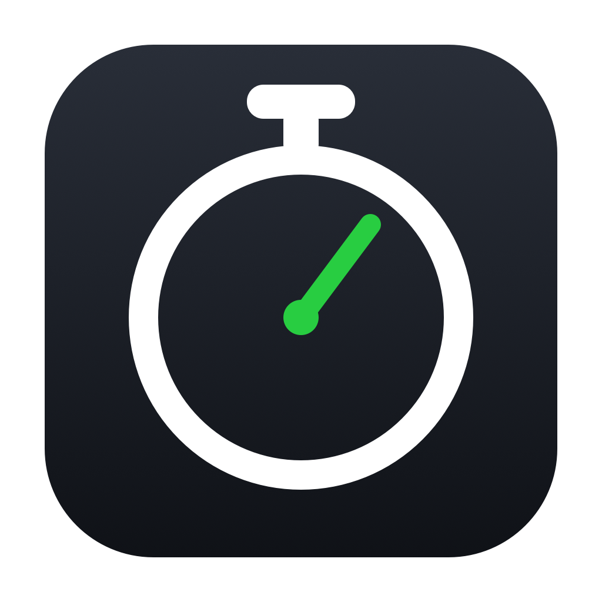
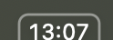
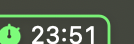
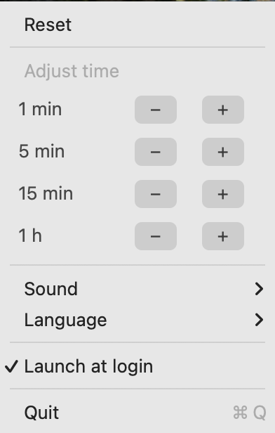
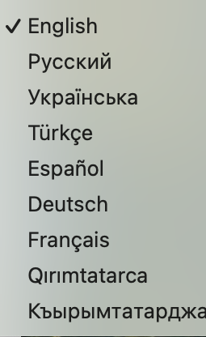

<h1 align="center">TickBar</h1>

<p align="center">
  <br>
  <em>A minimalist menu bar stopwatch for macOS.</em>
</p>

<p align="center">
  One click to start, one click to pause. No windows, no Dock icon — it just lives in your menu bar.
</p>

<p align="center">
  <a href="https://github.com/Yunique33/TickBar/raw/master/dist/TickBar.zip"><b>⬇︎ Download TickBar.zip</b></a>
  &nbsp;·&nbsp; macOS 11+
</p>

---

## Install

1. **[Download `TickBar.zip`](https://github.com/Yunique33/TickBar/raw/master/dist/TickBar.zip)** and unzip it.
2. Move **TickBar.app** to your `Applications` folder.
3. First launch: the app isn't code-signed, so **right-click it → Open**, then confirm. (Only needed once.)

If macOS still blocks it, clear the download flag from Terminal:

```bash
xattr -dr com.apple.quarantine /Applications/TickBar.app
```

Then look for the timer in your menu bar. To start it automatically at login, use **Launch at login** in the menu.

Prefer building from source? See [Build](#build) below.

---

## Look & feel

<table>
  <tr>
    <td align="center">
      <br>
      <sub><b>Paused</b> — white, dim border</sub>
    </td>
    <td align="center">
      <br>
      <sub><b>Running</b> — green border + ⏱ icon</sub>
    </td>
  </tr>
</table>

The digits never change size or weight between states — only the border and the small stopwatch icon light up green while it's counting, so it stays calm in the menu bar but is still glanceable.

<table>
  <tr>
    <td align="center" valign="top">
      <br>
      <sub>Right-click menu</sub>
    </td>
    <td align="center" valign="top">
      <br>
      <sub>8 languages, Crimean Tatar in two scripts</sub>
    </td>
  </tr>
</table>

## Features

- **Click to start / pause.** A single left click on the timer toggles counting.
- **Right click** (or Ctrl-click) opens the menu.
- **Persists across restarts.** The elapsed time and state are saved continuously, so quitting, relaunching, or rebooting never loses your time. If it was running when you quit, it keeps running from where it left off.
- **Adjust on the fly.** `−`/`+` steppers for **1 min · 5 min · 15 min · 1 h**, right inside the menu — the menu stays open so you can tap several times in a row. Never goes below zero.
- **Reset** from the menu.
- **Start sound** (only when starting, never on pause). 10 gentle built-in chimes plus a silent option.
- **8 interface languages**, including Crimean Tatar in both Latin and Cyrillic.
- **Launch at login** toggle.

## Languages

English · Русский · Українська · Türkçe · Español · Deutsch · Français · **Qırımtatarca** (Latin) · **Къырымтатарджа** (Cyrillic)

The language is picked from your system on first launch (falling back to English) and can be changed any time from **Language** in the menu.

## Sounds

Soft, short, quiet chimes — generated as bundled audio files:

**Drop** (default) · Ding · Bell · Glass · Sparkle · Chime · Soft — plus the system sounds **Pop · Glass · Tink**, and **No sound**.

Selecting a sound previews it. Sounds are produced by [`gensounds.py`](gensounds.py) and bundled into the app at build time; tweak the frequency / decay / volume there to taste.

## Requirements

- macOS 11 (Big Sur) or newer
- Xcode Command Line Tools (`xcode-select --install`) — provides `swiftc` and `python3`

## Build

```bash
./build.sh
```

This generates the sounds and app icon, compiles the binary, and assembles `TickBar.app` next to the sources.

## Run

```bash
open TickBar.app
```

You can move the resulting `.app` anywhere (e.g. `/Applications`).

### Launch at login

Toggle **Launch at login** in the menu. It writes a LaunchAgent at
`~/Library/LaunchAgents/bar.tick.tickbar.plist` pointing at the app's current
location — if you move the `.app`, toggle it off and on again to refresh the path.

## Project structure

| File | Purpose |
|------|---------|
| [`main.swift`](main.swift) | Stopwatch logic, menu bar rendering, menu, localization |
| [`makeicon.swift`](makeicon.swift) | Programmatic app icon generation |
| [`gensounds.py`](gensounds.py) | Generates the bundled chime sounds |
| [`Info.plist`](Info.plist) | Bundle manifest (`LSUIElement` → no Dock icon) |
| [`build.sh`](build.sh) | Builds the `.app`, sounds, and icon |

## License

MIT — see [LICENSE](LICENSE).
